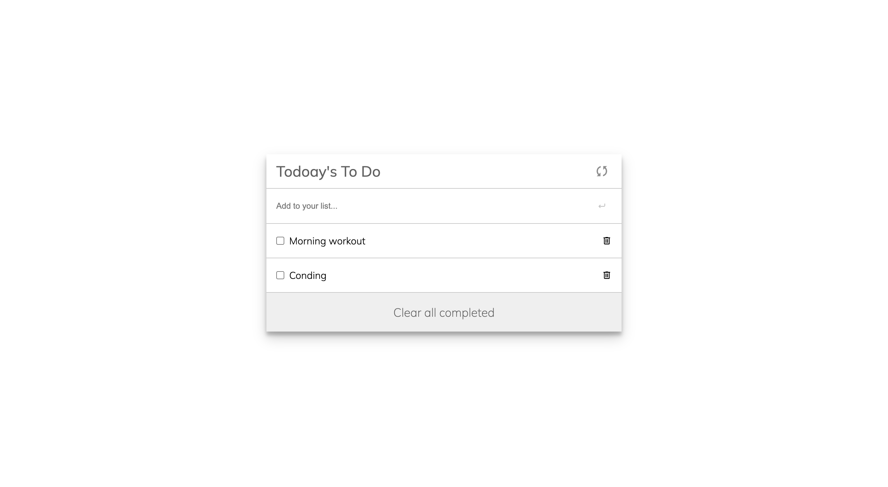

# Project Name

## Todo list web app

> A simple web app that helps the user to organize his tasks, check a task if completed, and delete the completed ones.

## SCREEN SHOT

## Built With

### Major languages

- HTML
- CSS
- Javascript

### Technologies used

- Github
- Git
- Visual Studio Code
- Webpack
- Linters

## Project Link on Github

https://github.com/z4cope/Todolist-webapp

## Live demo

https://z4cope.github.io/Todolist-webapp/dist/

## Getting Started

To get a local copy up and running follow these simple example steps.

### Prerequisites

- You must have a code compiler installed on your machine such as (VS code or Atom).

### Setup

- Open your code editor.
- Press cmd + shift + P and type gitclone and choose the first option.
- Paste the repo link inside the field and press enter.
- Run the command npm start to run the project on your localhost.

## Author

- GitHub: [@githubhandle](https://github.com/z4cope)
- Twitter: [@twitterhandle](https://twitter.com/mokhaledev)
- LinkedIn: [LinkedIn](https://www.linkedin.com/in/mookhaled)

## 🤝 Contributing

Contributions, issues, and feature requests are welcome!

Feel free to check the [issues page](https://github.com/z4cope/Todolist-webapp/issues).

## Show your support

Give a ⭐️ if you like this project!

## Acknowledgments

- Microverse designs.

## 📝 License

This project is [MIT](./LICENCE) licensed.
